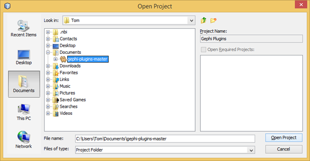
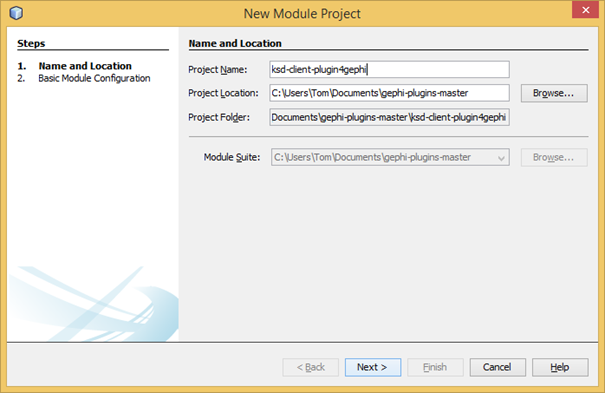
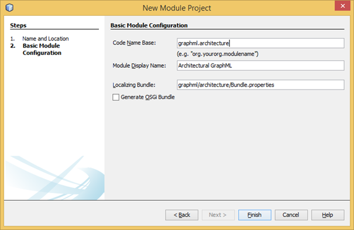

**How To set up the environment for the development of the Gephi Plugin**

1.	Download and install the Java Development Kit (JDK), version 7. Tested with version “Java SE Development Kit 7u67”

2.	Download and install the NetBeans IDE (tested with NetBeans IDE 7.4). Only Java SE version is required for Gephi. If asked, install NetBeans with JUnit.

3.	There is an out of the box development environment on the gephi-plugins repository on GitHub. Get its source code as zip-File from “https://github.com/gephi/gephi-plugins”

4.	Unzip the files to your working directory.

5.	Open NetBeans IDE, go to “File > Open Project”. Select the file unzipped in step 4 as project folder. Wait until he recognizes the project, then click on “Open Project”.

  

6.	Try to run the software. The gephi surface should pop up.

7.	Right-click on “Modules” and choose “Add new…”

8.	Insert the data shown in the following two pictures.

  
  
  

9.	Finish the module creation and close the NetBeans IDE.
 
10.	Delete all data in the new created folder “ksd-client-plugin4gephi” in the working directory.

11.	Download the source code of the plug-in from Gitlab under git@gitlab.ai.ar.tum.de:ksd-research-group/ksd-client-plugin4gephi.git. Set your working directory as download folder, so that it replaces the data deleted in step 10.

12.	Start NetBeans IDE

13.	Build project and run. The plug-in is added to Gephi.